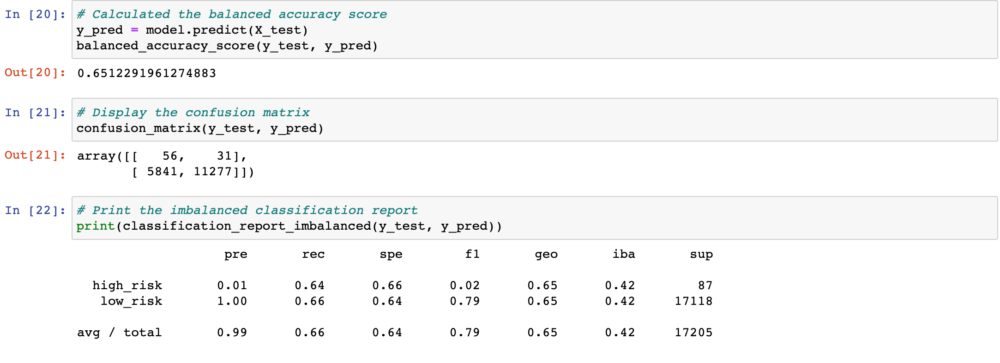
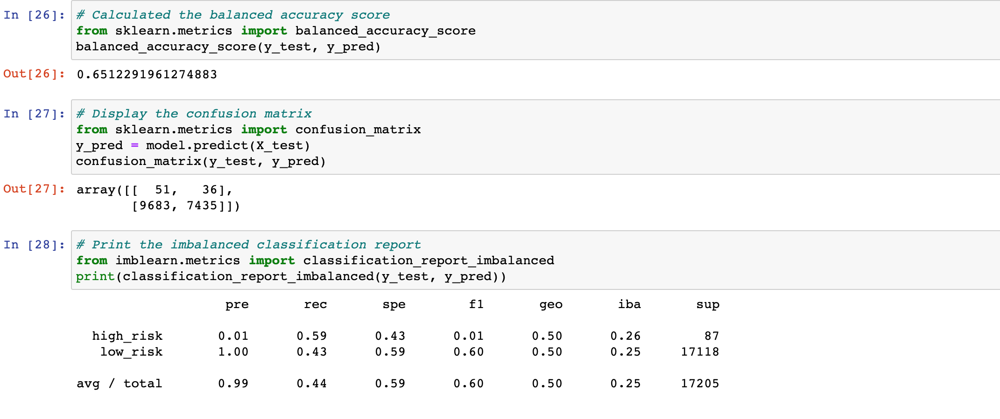
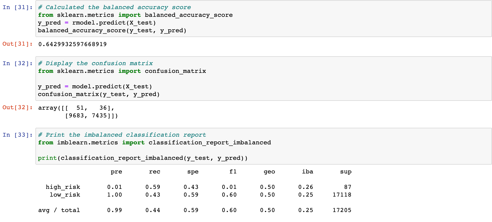
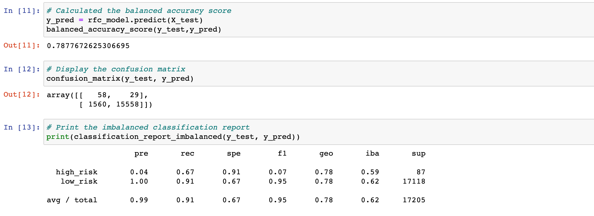
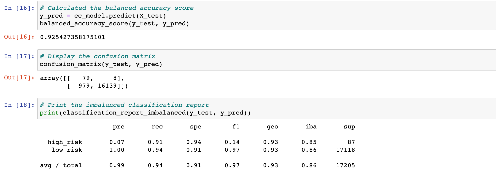

# Credit_Risk_Analysis
Using Machine Learning to analysis credit risk 
## Overview 

## Resources 

- Data: LoanStats_2019Q1.csv
- Source: Jupyter Notebook, Machine Learning, Pandas 

## Results 

- Naive Random Oversampling

.

- SMOTE Oversampling

.

- Undersampling

.

- Combination (Over and Under) Sampling

.

- Balanced Random Forest Classifier

.

- Easy Ensemble AdaBoost Classifier

.

## Summary 
